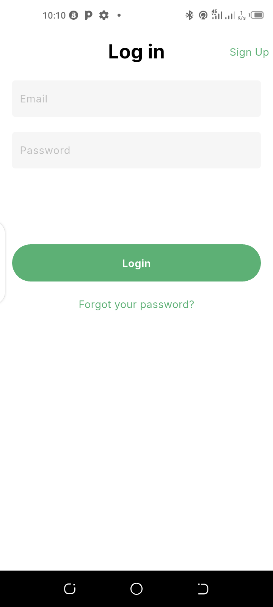
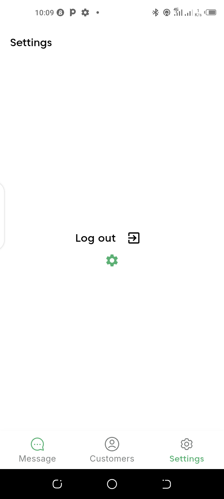
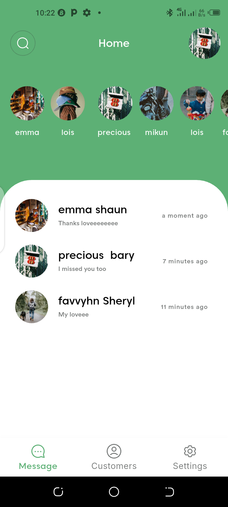
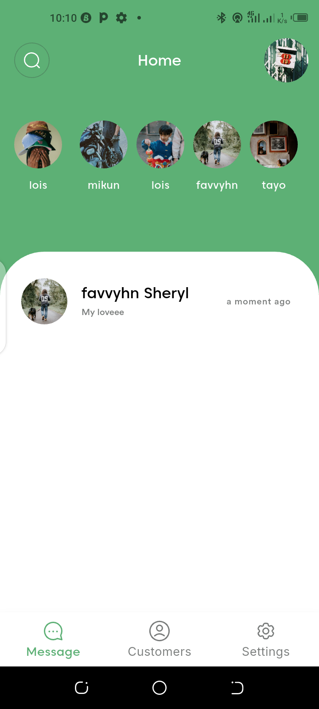
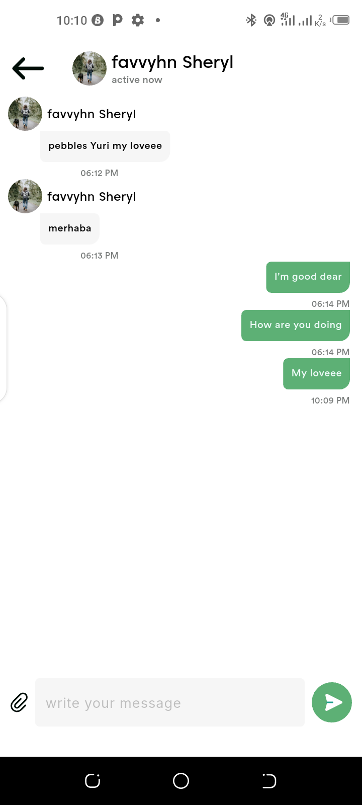

# floww

Floww is a real-time chat application built with Flutter and Firebase, featuring user authentication, chat history, and profile images.

## Features ✨
- Firebase Authentication
- Random Profile image Assignment 
- Home Screen layout 
  - Top section: Displays the last 10 users who registerd 
  - Lower section: Displays users who have chatted with the current user.
- Real- Time messaging
- Swipe to delete chat 
- TimeStamps

## Screenshots 📸








## A video showcasing the app's functionality 🎥

## Installation 🚀
To set up the project locally, follow these steps:

1. Clone the repository:
   ```bash
   git clone https://github.com/FavourTy/smart_/tree/main/floww

2. Navigate to the project directory:
   ```bash
   cd floww

3. Install the required dependencies:
   ```bash
   flutter pub get 

4. Run the app:
   ```bash
   flutter run

## Technologies Used 🛠️

- Flutter
- Dart
- Figma
- Firebase FireStore
- Firebase Authentication

## Future Improvements 🚀
- implement online Status for users
- improve ui
