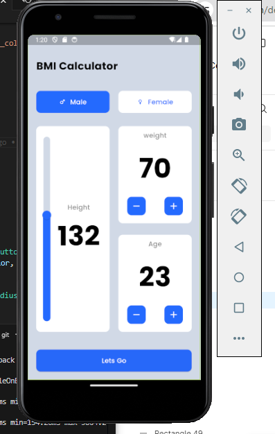
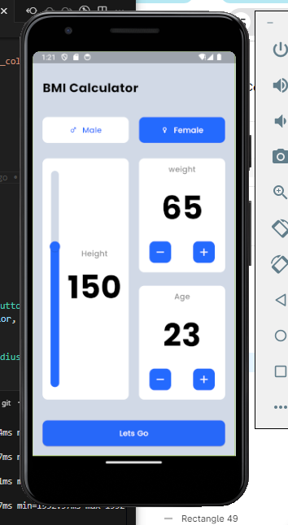
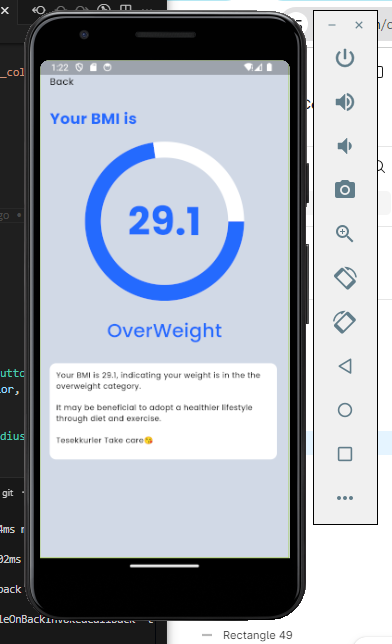
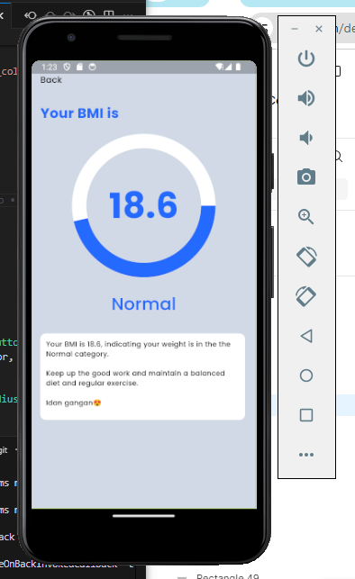
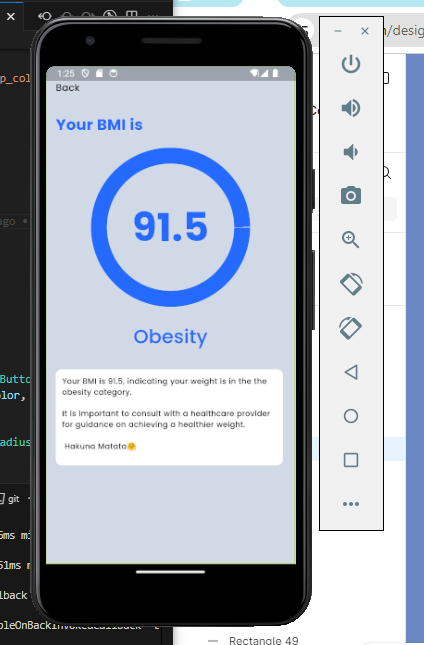
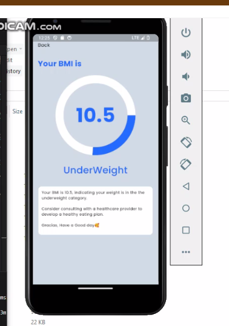

# BMI Calculator Flutter app

A simple and intutive BMI Calculator built with flutter
This app allows users to calculate their Body Mass Index(BMI) based on their weight and height and provides a BMI category(e.g Underweight, Normal weight, Overweight and obesity).

## Features ✨
- Input weight (kg) and height (m) to calculate BMI.
- Displays BMI results along with corresponding health status.
- Interactive and responsive user interface.

## Screenshots 📸








## A video showcasing the app's functionality 🎥

- [BMI Calculator Application Demo](https://drive.google.com/open?id=1-RGFXSunWHvevq3UEb-Jb3tBLXfvTBK6&usp=drive_fs)

## Installation 🚀
To set up the project locally, follow these steps:

1. Clone the repository:
   ```bash
   git clone https://github.com/FavourTy/smart_/tree/main/mini_project_1

2. Navigate to the project directory:
   ```bash
   cd mini_project_1

3. Install the required dependencies:
   ```bash
   flutter pub get 

4. Run the app:
   ```bash
   flutter run


## Technologies Used 🛠️

- Flutter
- Dart
- Figma


